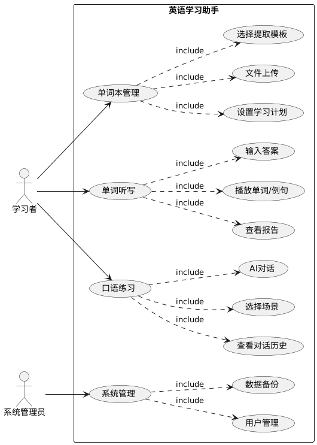

# 英语学习助手

## 简介

本项目旨在为用户提供一个既有趣又有效的英语学习平台，特别注重单词记忆和口语练习。通过卡通、动漫风格的界面设计，我们希望创造一个轻松愉快的学习环境，使用户在享受中提升自己的英语水平。本软件是通过以微信小程序作为前端，javaweb作为后端功能，pythonweb提供ai处理能力。

## 用户角色与用例

### 用户角色
- 学习者：使用系统进行英语学习的普通用户
- 系统管理员：负责系统维护和用户管理

### 用例图


## 核心功能

### 一、英语单词听写功能

1. **文件与图片上传**
   - 支持文件格式：txt、pdf、word、excel、ppt、常见图片格式
   - 文件大小限制：单个文件不超过10MB
   - 批量上传限制：单次最多10个文件
   - 上传流程：
     1. 选择文件
     2. 预览文件列表
     3. 确认上传
     4. 显示上传进度
     5. 上传完成提示

2. **提取模板选择**
   提供以下模板选项：
   - 完整模板：单词 + 中文释义 + 例句
   - 基础模板：单词 + 中文释义
   - 进阶模板：单词 + 例句
   - 简单模板：仅单词
   - 释义模板：中文释义 + 例句
   - 翻译模板：仅中文释义

3. **个性化学习计划**
   - 学习目标设置
     - 总单词量显示
     - 每日学习量设置（推荐20-50个）
     - 预计完成时间计算
   - 学习算法选择
     - 艾宾浩斯遗忘曲线
     - 顺序学习
     - 随机学习
     - 难度优先
   - 复习提醒设置
     - 每日固定时间
     - 智能提醒（基于学习数据）

4. **单词听写功能**
   - 播放控制
     - 播放/暂停
     - 重复播放
     - 语速调节
     - 音量调节
   - 答题界面
     - 单词输入框
     - 跳过按钮
     - 提交按钮
     - 进度显示

5. **听写报告**
   - 本次得分统计
   - 错误单词列表
   - 正确率分析
   - 学习建议
   - 导出功能

### 二、英语口语智能体对话功能

1. **场景选择**
   - 日常生活
   - 商务会议
   - 旅游出行
   - 学术讨论
   - 职场交际

2. **AI对话功能**
   - 语音识别
   - 实时对话
   - 发音纠正
   - 表达建议
   - 情境模拟

3. **对话历史**
   - 历史记录保存
   - 重要对话标记
   - 学习重点提取
   - 进步追踪

## 界面原型设计

### 主界面布局
```ascii
+------------------+
|    英语学习助手    |
+------------------+
|  [单词听写]       |
|  [口语练习]       |
|  [学习统计]       |
|  [个人中心]       |
+------------------+
```

### 单词听写界面
```ascii
+------------------------+
|     单词听写练习        |
+------------------------+
| ▶️ [播放] 🔁 [重复]    |
|                        |
| [____________] 输入框   |
|                        |
| [跳过] [提交]          |
|                        |
| 进度: 7/20            |
+------------------------+
```

### 口语练习界面
```ascii
+------------------------+
|      口语练习          |
+------------------------+
| 场景：咖啡厅点餐        |
|                        |
| AI: May I take your   |
|     order?            |
|                        |
| [🎤] 开始说话          |
| [📝] 查看建议          |
+------------------------+
```

## 技术实现

### 前端技术栈
- 微信小程序
- WXML + WXSS
- JavaScript

### 后端技术栈
- Java Web (Spring Boot)
- Python Web (Flask/FastAPI)
- MySQL 数据库
- Redis 缓存

### AI 技术
- 语音识别：科大讯飞API
- 自然语言处理：OpenAI API
- 语音合成：Azure TTS

## 数据库设计

### 用户表(user)
- id: 主键
- openid: 微信openid
- nickname: 昵称
- avatar: 头像
- created_at: 创建时间
- updated_at: 更新时间

### 单词本表(wordbook)
- id: 主键
- user_id: 用户id
- name: 单词本名称
- word_count: 单词数量
- created_at: 创建时间

### 单词表(word)
- id: 主键
- wordbook_id: 单词本id
- word: 单词
- translation: 翻译
- example: 例句
- status: 学习状态

### 学习记录表(study_record)
- id: 主键
- user_id: 用户id
- word_id: 单词id
- type: 记录类型
- score: 得分
- created_at: 创建时间

## 使用指南

### 快速开始
1. 扫描小程序码进入
2. 选择功能模块
3. 按照界面提示操作

### 注意事项
1. 文件上传大小限制
2. 网络要求
3. 隐私保护说明

## 后续优化计划
1. 增加社交功能
2. 引入游戏化元素
3. 支持更多学习算法
4. 优化AI对话体验
5. 添加学习数据分析