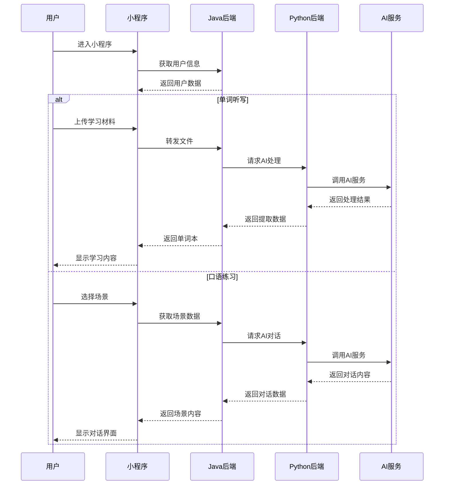
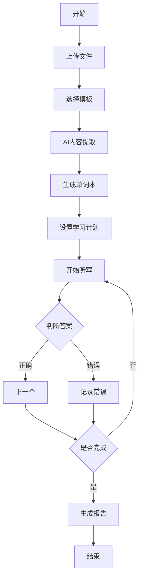
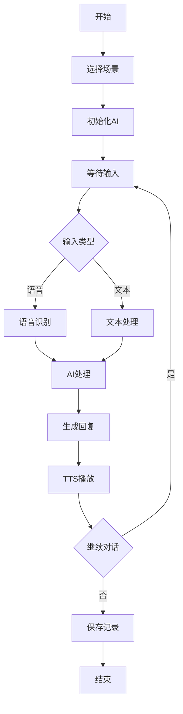

# 英语学习助手项目说明文档

## 1. 目的

本文档旨在详细说明英语学习助手项目的需求分析、系统设计和实现方案。

### 1.1 预期读者
- 项目开发团队成员
- 产品经理
- 测试人员
- 运维人员

### 1.2 术语表
| 术语 | 说明 |
|------|------|
| AI | 人工智能 |
| TTS | 文本转语音技术 |
| ASR | 自动语音识别 |
| NLP | 自然语言处理 |

### 1.3 参考资料
- 微信小程序开发文档
- Spring Boot 官方文档
- OpenAI API 文档
- 科大讯飞 API 文档
- Azure TTS API 文档

## 2. 需求分析

### 2.1 整体业务流程

#### 文字说明
1. 用户通过微信小程序进入系统
2. 选择单词听写或口语练习功能
3. 系统根据用户选择提供相应服务
4. 记录学习数据并生成分析报告

#### 时序图



## 2.2 主要功能模块

### 2.2.1 单词听写功能

#### 2.2.1.1 功能说明
提供用户上传学习材料、生成单词本、进行听写练习的完整功能。

#### 2.2.1.2 业务流程
1. 文件上传与处理
2. 模板选择与内容提取
3. 学习计划制定
4. 听写练习
5. 成果报告生成

#### 2.2.1.3 业务规则
- 文件大小限制：单个不超过10MB
- 批量上传限制：单次最多10个文件
- 学习量建议：每日20-50个单词
- 复习周期：按艾宾浩斯遗忘曲线设置

#### 2.2.1.4 输入要素
- 学习材料文件
- 模板选择
- 学习计划参数
- 听写答案

#### 2.2.1.5 输出要素
- 单词本内容
- 学习计划
- 听写报告
- 学习建议

### 2.2.2 口语练习功能

#### 2.2.2.1 功能说明
提供AI驱动的口语对话练习，支持多场景模拟。

#### 2.2.2.2 业务流程
1. 场景选择
2. AI对话初始化
3. 语音交互
4. 实时纠正
5. 对话记录保存

#### 2.2.2.3 业务规则
- 对话上下文保持
- 发音准确度要求
- 场景切换规则
- 历史记录保存期限

#### 2.2.2.4 输入要素
- 场景选择
- 用户语音
- 对话指令

#### 2.2.2.5 输出要素
- AI回复
- 发音评估
- 表达建议
- 练习报告

## 3. 系统设计

### 3.1 单词听写模块

#### 3.1.1 功能描述
实现单词学习全流程，包括材料上传、内容提取、听写练习等功能。

#### 3.1.2 界面设计
```ascii
+------------------------+
|     单词听写练习        |
+------------------------+
| ▶️ [播放] 🔁 [重复]    |
|                        |
| [____________] 输入框   |
|                        |
| [跳过] [提交]          |
|                        |
| 进度: 7/20            |
+------------------------+
```

#### 3.1.3 接口文档（入参/出参）
接口1.dealInputFile 文件上传接口，由javaweb检查文件格式和文件大小，绑定用户与文件关系，由pythonweb返回文件单词总数。
接口2.createUserSchedule 生成用户学习计划，根据用户选择和计划参数生成学习计划，由javaweb接收参数,由。
接口3.startDailySchedule 获取指定日期的每日学习计划，返回学习计划内容。

#### 3.1.5 算法/设计方法
- 文本提取算法
- 艾宾浩斯遗忘曲线
- 学习进度计算
- 正确率评估

#### 3.1.6 流程逻辑



### 3.2 口语练习模块

#### 3.2.1 功能描述
提供AI驱动的口语对话练习功能，支持场景模拟和实时反馈。

#### 3.2.2 界面设计
```ascii
+------------------------+
|      口语练习          |
+------------------------+
| 场景：咖啡厅点餐        |
|                        |
| AI: May I take your   |
|     order?            |
|                        |
| [🎤] 开始说话          |
| [📝] 查看建议          |
+------------------------+
```

#### 3.2.3 接口文档（入参/出参）


#### 3.2.5 算法/设计方法
- 语音识别算法
- 自然语言处理
- 发音评估
- 对话管理

#### 3.2.6 流程逻辑
